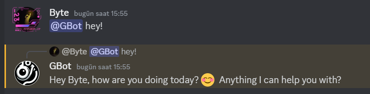

# Gemini - Discord SelfBot

**Gemini - Discord SelfBot** is a simple Discord self-bot application that integrates with Gemini to create a chat application. This bot allows users to interact from anywhere on Discord with a personalized experience.

## • Features

- **Chat Anywhere**: Interact with the bot in DMs, groups, or servers. To use the bot in servers, you must mention it.
- **Image Sending**: You can send images to the bot directly.
- **Drawing Requests**: By adding `/draw` at the beginning of your message, you can request the bot to draw an image based on your description.
- **Memory**: The bot remembers the last 100 messages from channels it interacts with.
- **Personalization**: The bot can recognize users and address them by their names.
___
## • Requirements

Ensure you have the following installed:

- [Node.js](https://nodejs.org/) (v14 or later)
- [npm](https://www.npmjs.com/) (comes with Node.js)
___
## • Installation

Follow these steps to install and run the project:

1. **Clone the repository:**

 ```bash
 git clone https://github.com/aliumutidiz/Gemini-Discord-SelfBot
  ```
2. **Navigate to the project directory:**

 ```bash
  cd Gemini-Discord-SelfBot
  ```
3. **Install the dependencies:**

Install all the necessary packages with:

  ```bash
  npm install
  ```
4. **Set up environment variables:**

Copy the .env.example file to .env:

   ```bash
   cp .env.example .env
   ```
Edit the .env file to include your Discord bot token and any other required settings.
___
## • Usage
To start the bot, use:

   ```bash
   npm start
   ```
Once started, the bot will be active and ready to use in your Discord server.
___
 
## 🚨 Important Note 🚨

**To change the bot's name, the person it will obey, or aspects of its personality, you need to edit the variables in the `src/Config/CreateBasePersonality.mjs` file according to your preferences. This customization is essential for tailoring the bot to your specific needs.**
___
 
## • Bot Related Images

Here are some images showcasing the functionality of the Gemini - Discord SelfBot:

1. **Direct Messages (DMs)**  
     
   *Shows the bot interacting in Direct Messages (DMs).*

2. **Group and Server Messages**  
     
   *Demonstrates the bot's interaction in groups and server channels.*

3. **Recognizing Users**  
     
   *Highlights the bot's capability to recognize users and address them by their names.*

4. **/draw Messages**  
     
   *Shows the bot's ability to draw an image based on a given description.*
___
## • Bot Commands:
- **Chat**: Send messages directly to the bot or mention it in a server to start a conversation.
- **Send Images**: Directly send images to the bot.
- **/draw**: Use `/draw` at the start of a message to request an image based on your description.
___
## • Admin Commands:
- **clearuserdata**: Use this command in any channel to delete the data of users in that channel.
- **clearchatdata**: Use this command in any channel to delete the chat history in that channel.

___

## Fork the repository.
Create a new branch (git checkout -b feature/YourFeature).
Commit your changes (git commit -m 'Add YourFeature').
Push the branch (git push origin feature/YourFeature).
Open a Pull Request.
